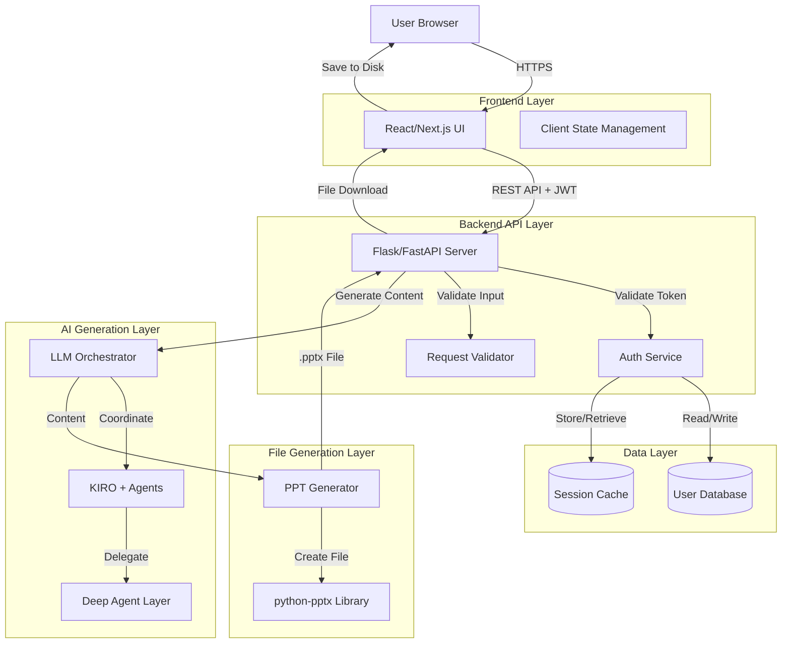

# Design Document: AI-Powered PowerPoint Presentation Generator

## Overview

The AI-Powered PowerPoint Presentation Generator is a full-stack web application that transforms user prompts into professional PowerPoint presentations. The system follows a multi-tier architecture with clear separation of concerns across authentication, content generation, and file creation layers.

### Key Design Principles

1. **Security First**: JWT-based authentication with secure password hashing and token validation
2. **Separation of Concerns**: Distinct layers for UI, API, authentication, AI orchestration, and file generation
3. **Scalability**: Stateless API design enabling horizontal scaling
4. **User Experience**: Asynchronous processing with progress feedback and clear error messaging
5. **Reliability**: Comprehensive validation, timeout handling, and graceful error recovery

### System Context

The system serves authenticated users who need to quickly generate professional presentations. Users interact through a web interface, provide minimal input (topic + optional parameters), and receive a downloadable .pptx file. The system leverages AI agents for content generation and python-pptx for file creation.

## Architecture

### High-Level Architecture



### Component Architecture

#### Frontend Layer (React/Next.js)

**Responsibilities:**
- User interface rendering and interaction
- Form validation and user input collection
- JWT token storage and management
- API communication
- File download initiation
- Progress indication and error display

**Key Components:**
- `RegistrationForm`: User registration interface
- `LoginForm`: Authentication interface
- `PromptForm`: Presentation generation input
- `ProgressIndicator`: Generation status display
- `ErrorBoundary`: Error handling and display
- `AuthProvider`: JWT token management
- `APIClient`: Backend communication layer

#### Backend API Layer (Flask/FastAPI)

**Responsibilities:**
- HTTP request handling and routing
- JWT token validation
- Request/response serialization
- Orchestration of downstream services
- File serving and download preparation
- Error handling and logging

**Key Endpoints:**
- `POST /api/auth/register`: User registration
- `POST /api/auth/login`: User authentication
- `POST /api/presentations/generate`: Presentation generation
- `GET /api/presentations/download/{id}`: File download

**Middleware:**
- Authentication middleware (JWT validation)
- Request validation middleware
- Error handling middleware
- CORS middleware
- Rate limiting middleware

#### Auth Service

**Responsibilities:**
- User registration and credential storage
- Password hashing (bcrypt/argon2)
- JWT token generation and validation
- Session management
- User lookup and authentication

**Key Functions:**
- `register_user(username, password) -> JWT`
- `authenticate_user(username, password) -> JWT`
- `validate_token(token) -> User`
- `hash_password(password) -> hash`
- `verify_password(password, hash) -> bool`

#### LLM Orchestrator

**Responsibilities:**
- Coordinate AI agents for content generation
- Parse and structure user prompts
- Manage generation workflow (title → agenda → content → summary)
- Apply tone and style parameters
- Handle generation timeouts and retries
- Return structured content for PPT generation

**Workflow:**
1. Parse prompt (topic, tone, slide_count)
2. Generate title slide content
3. Generate agenda/outline
4. Generate content slides (parallel or sequential)
5. Generate summary slide
6. Return structured content object

**Content Structure:**
```python
{
  "title": {"main": str, "subtitle": str},
  "agenda": {"items": [str]},
  "slides": [
    {"title": str, "content": [str], "notes": str}
  ],
  "summary": {"title": str, "takeaways": [str]}
}
```

#### PPT Generator (python-pptx)

**Responsibilities:**
- Create .pptx file from structured content
- Apply professional templates and styling
- Format text, bullets, and layouts
- Generate consistent slide designs
- Return binary .pptx file

**Key Functions:**
- `create_presentation(content) -> bytes`
- `add_title_slide(prs, title_data)`
- `add_agenda_slide(prs, agenda_data)`
- `add_content_slide(prs, slide_data)`
- `add_summary_slide(prs, summary_data)`
- `apply_template(prs, template_name)`

## Components and Interfaces

### Frontend Components

#### AuthProvider Component
```typescript
interface AuthContextType {
  token: string | null;
  user: User | null;
  login: (username: string, password: string) => Promise<void>;
  register: (username: string, password: string) => Promise<void>;
  logout: () => void;
  isAuthenticated: boolean;
}
```

#### PromptForm Component
```typescript
interface PromptFormProps {
  onSubmit: (prompt: PresentationPrompt) => Promise<void>;
  isLoading: boolean;
}

interface PresentationPrompt {
  topic: string;
  tone?: 'formal' | 'casual' | 'fun' | 'professional';
  slideCount?: number; // 5-20
}
```

### Backend API Interfaces

#### Authentication Endpoints

**POST /api/auth/register**
```json
Request:
{
  "username": "string (unique, 3-50 chars)",
  "password": "string (min 8 chars)"
}

Response (201):
{
  "token": "string (JWT)",
  "user": {
    "id": "string",
    "username": "string"
  }
}

Error (400):
{
  "error": "Username already exists" | "Password too short"
}
```

**POST /api/auth/login**
```json
Request:
{
  "username": "string",
  "password": "string"
}

Response (200):
{
  "token": "string (JWT)",
  "user": {
    "id": "string",
    "username": "string"
  }
}

Error (401):
{
  "error": "Invalid credentials"
}
```

#### Presentation Generation Endpoint

**POST /api/presentations/generate**
```json
Headers:
{
  "Authorization": "Bearer <JWT>"
}

Request:
{
  "topic": "string (max 500 chars)",
  "tone": "formal" | "casual" | "fun" | "professional" (optional),
  "slideCount": number (5-20, optional, default 8)
}

Response (200):
{
  "presentationId": "string",
  "filename": "string",
  "downloadUrl": "string",
  "generatedAt": "ISO8601 timestamp"
}

Error (400):
{
  "error": "Validation error message"
}

Error (401):
{
  "error": "Authentication required"
}

Error (408):
{
  "error": "Generation timeout"
}

Error (500):
{
  "error": "Generation failed: <details>"
}
```

**GET /api/presentations/download/{presentationId}**
```
Headers:
{
  "Authorization": "Bearer <JWT>"
}

Response (200):
Content-Type: application/vnd.openxmlformats-officedocument.presentationml.presentation
Content-Disposition: attachment; filename="<topic>_<timestamp>.pptx"
Body: <binary .pptx file>

Error (404):
{
  "error": "Presentation not found"
}
```

### LLM Orchestrator Interface

```python
class LLMOrchestrator:
    def generate_presentation_content(
        self,
        topic: str,
        tone: Optional[str] = None,
        slide_count: int = 8
    ) -> PresentationContent:
        """
        Generate structured presentation content using AI agents.
        
        Args:
            topic: The presentation topic
            tone: Optional tone (formal, casual, fun, professional)
            slide_count: Number of content slides (5-20)
            
        Returns:
            PresentationContent object with structured slide data
            
        Raises:
            GenerationTimeoutError: If generation exceeds 120 seconds
            GenerationError: If AI generation fails
        """
        pass
```

### PPT Generator Interface

```python
class PPTGenerator:
    def create_presentation(
        self,
        content: PresentationContent,
        template: str = "professional"
    ) -> bytes:
        """
        Create a .pptx file from structured content.
        
        Args:
            content: Structured presentation content
            template: Template name for styling
            
        Returns:
            Binary .pptx file data
            
        Raises:
            FileCreationError: If .pptx creation fails
        """
        pass
```

## Data Models

### User Model

```python
class User:
    id: str  # UUID
    username: str  # Unique, 3-50 characters
    password_hash: str  # bcrypt/argon2 hash
    created_at: datetime
    last_login: datetime
    
    def __init__(self, username: str, password: str):
        self.id = generate_uuid()
        self.username = username
        self.password_hash = hash_password(password)
        self.created_at = datetime.utcnow()
```

### JWT Token Payload

```python
class TokenPayload:
    user_id: str
    username: str
    issued_at: int  # Unix timestamp
    expires_at: int  # Unix timestamp (issued_at + 24 hours)
    
    def to_jwt(self, secret_key: str) -> str:
        """Encode payload as JWT"""
        pass
    
    @staticmethod
    def from_jwt(token: str, secret_key: str) -> TokenPayload:
        """Decode and validate JWT"""
        pass
```

### Presentation Prompt Model

```python
class PresentationPrompt:
    topic: str  # Max 500 characters
    tone: Optional[Literal['formal', 'casual', 'fun', 'professional']]
    slide_count: int  # 5-20, default 8
    
    def validate(self) -> List[str]:
        """Return list of validation errors"""
        errors = []
        if not self.topic or len(self.topic) > 500:
            errors.append("Topic must be 1-500 characters")
        if self.slide_count < 5 or self.slide_count > 20:
            errors.append("Slide count must be 5-20")
        if self.tone and self.tone not in ['formal', 'casual', 'fun', 'professional']:
            errors.append("Invalid tone value")
        return errors
```

### Presentation Content Model

```python
class SlideContent:
    title: str
    content: List[str]  # Bullet points or paragraphs
    notes: Optional[str]  # Speaker notes

class PresentationContent:
    title: TitleSlide
    agenda: AgendaSlide
    slides: List[SlideContent]
    summary: SummarySlide
    
    def to_dict(self) -> dict:
        """Serialize to dictionary"""
        pass
    
    @staticmethod
    def from_dict(data: dict) -> PresentationContent:
        """Deserialize from dictionary"""
        pass

class TitleSlide:
    main_title: str
    subtitle: Optional[str]

class AgendaSlide:
    items: List[str]

class SummarySlide:
    title: str
    takeaways: List[str]
```

### Presentation Metadata Model

```python
class PresentationMetadata:
    id: str  # UUID
    user_id: str
    topic: str
    filename: str
    file_path: str  # Temporary storage path
    created_at: datetime
    expires_at: datetime  # Auto-cleanup after 1 hour
    
    def generate_filename(self) -> str:
        """Generate descriptive filename with timestamp"""
        safe_topic = sanitize_filename(self.topic)
        timestamp = datetime.utcnow().strftime("%Y%m%d_%H%M%S")
        return f"{safe_topic}_{timestamp}.pptx"
```


## Correctness Properties

*A property is a characteristic or behavior that should hold true across all valid executions of a system—essentially, a formal statement about what the system should do. Properties serve as the bridge between human-readable specifications and machine-verifiable correctness guarantees.*

### Property Reflection

After analyzing all acceptance criteria, I identified the following testable properties. Several criteria were combined or eliminated to avoid redundancy:

- Password validation (1.4) and error handling (1.5) → Combined into single validation property
- Password hashing (1.6) and plain text prohibition (1.7) → Combined into single hashing property
- All PPT slide inclusion properties (6.2-6.5) → Combined into comprehensive slide inclusion property
- Input validation properties (10.2-10.4) → Kept separate as they test different validation rules

### Property 1: Password Length Validation

*For any* string input, the password validation function SHALL correctly identify whether the string has at least 8 characters, returning true for strings with 8 or more characters and false otherwise.

**Validates: Requirements 1.4, 1.5**

### Property 2: Password Hashing Irreversibility

*For any* valid password string, the hashing function SHALL produce a hash value that is different from the original password and follows the expected hash format (bcrypt/argon2), ensuring passwords are never stored in plain text.

**Validates: Requirements 1.6, 1.7**

### Property 3: Password Verification Round-Trip

*For any* password string, after hashing the password, the verification function SHALL return true when verifying the original password against the hash, and SHALL return false when verifying any different password against the same hash.

**Validates: Requirements 2.5**

### Property 4: JWT Token Expiration Time

*For any* user data used to generate a JWT token, the token's expiration timestamp SHALL be exactly 24 hours (86400 seconds) after the issued_at timestamp.

**Validates: Requirements 2.3**

### Property 5: JWT Signature Validation

*For any* JWT token, the signature validation function SHALL correctly identify valid signatures (signed with the correct secret key) as valid and invalid signatures (tampered or signed with wrong key) as invalid.

**Validates: Requirements 3.3**

### Property 6: Slide Count Generation

*For any* valid slide count parameter (5-20) or None, the LLM Orchestrator SHALL generate presentation content with exactly the specified number of content slides, or 8 content slides when the parameter is None.

**Validates: Requirements 5.2**

### Property 7: Presentation Structure Completeness

*For any* generated presentation content, the PPT Generator SHALL create a .pptx file that includes all required slide types: one title slide, one agenda slide, all content slides from the input, and one summary slide.

**Validates: Requirements 6.2, 6.3, 6.4, 6.5**

### Property 8: Template Consistency

*For any* presentation content, all slides in the generated .pptx file SHALL use the same template styling, ensuring consistent fonts, colors, and layout across the entire presentation.

**Validates: Requirements 6.6**

### Property 9: Filename Generation and Sanitization

*For any* topic string (including those with special characters, spaces, or path separators) and any timestamp, the filename generation function SHALL produce a valid filename that includes a sanitized version of the topic, the timestamp, and the .pptx extension, with all dangerous characters removed or replaced.

**Validates: Requirements 7.2**

### Property 10: Content-Type Header Correctness

*For any* .pptx file served by the Backend API, the HTTP response SHALL include the Content-Type header set to "application/vnd.openxmlformats-officedocument.presentationml.presentation".

**Validates: Requirements 8.3**

### Property 11: Topic Length Validation

*For any* string input, the topic validation function SHALL correctly identify whether the string length is within the valid range (1-500 characters), returning an error for empty strings or strings exceeding 500 characters.

**Validates: Requirements 10.2**

### Property 12: Slide Count Range Validation

*For any* numeric input, the slide count validation function SHALL correctly identify whether the number is within the valid range (5-20 inclusive), returning an error for values outside this range.

**Validates: Requirements 10.3**

### Property 13: Tone Enum Validation

*For any* string input, the tone validation function SHALL correctly identify whether the string is one of the allowed values ('formal', 'casual', 'fun', 'professional'), returning an error for any other value.

**Validates: Requirements 10.4**

### Property 14: Input Sanitization Safety

*For any* user input string (including those containing SQL injection attempts, XSS payloads, or path traversal sequences), the sanitization function SHALL remove or escape all dangerous characters and patterns, producing a safe output string.

**Validates: Requirements 10.5**

### Property 15: Content Serialization Round-Trip

*For any* valid PresentationContent object, serializing the object to a dictionary and then deserializing it back SHALL produce an equivalent PresentationContent object with all fields preserved.

**Validates: Data model integrity**

## Error Handling

### Error Categories

The system implements comprehensive error handling across all layers:

#### 1. Authentication Errors (4xx)

**401 Unauthorized**
- Invalid credentials during login
- Missing JWT token
- Expired JWT token
- Invalid JWT signature

**409 Conflict**
- Duplicate username during registration

**Error Response Format:**
```json
{
  "error": "Authentication failed",
  "message": "Invalid username or password",
  "code": "AUTH_INVALID_CREDENTIALS"
}
```

#### 2. Validation Errors (400)

**Input Validation Failures:**
- Empty topic
- Topic exceeding 500 characters
- Slide count outside 5-20 range
- Invalid tone value
- Password shorter than 8 characters

**Error Response Format:**
```json
{
  "error": "Validation failed",
  "message": "Topic must be between 1 and 500 characters",
  "code": "VALIDATION_TOPIC_LENGTH",
  "field": "topic"
}
```

#### 3. Generation Errors (5xx)

**500 Internal Server Error**
- LLM Orchestrator failure
- PPT Generator failure
- Unexpected system errors

**503 Service Unavailable**
- LLM service unavailable
- System overload

**408 Request Timeout**
- Generation exceeds 200 seconds

**Error Response Format:**
```json
{
  "error": "Generation failed",
  "message": "Unable to generate presentation content",
  "code": "GENERATION_LLM_FAILURE",
  "retryable": true
}
```

#### 4. File Errors (5xx)

**500 Internal Server Error**
- .pptx file creation failure
- File system write errors

**404 Not Found**
- Presentation file not found (expired or invalid ID)

**Error Response Format:**
```json
{
  "error": "File operation failed",
  "message": "Unable to create presentation file",
  "code": "FILE_CREATION_ERROR"
}
```

### Error Handling Strategy

#### Frontend Error Handling

1. **Network Errors**: Display user-friendly message, offer retry
2. **Validation Errors**: Show inline field errors, prevent submission
3. **Authentication Errors**: Redirect to login, clear invalid tokens
4. **Generation Errors**: Display error message, offer to try again
5. **Timeout Errors**: Inform user, suggest reducing slide count

**User-Friendly Error Messages:**
```typescript
const ERROR_MESSAGES = {
  AUTH_INVALID_CREDENTIALS: "Username or password is incorrect. Please try again.",
  VALIDATION_TOPIC_LENGTH: "Please enter a topic between 1 and 500 characters.",
  GENERATION_TIMEOUT: "Generation is taking longer than expected. Try reducing the number of slides.",
  GENERATION_LLM_FAILURE: "We're having trouble generating your presentation. Please try again in a moment.",
  FILE_CREATION_ERROR: "Unable to create your presentation file. Please try again."
};
```

#### Backend Error Handling

1. **Request Validation**: Validate all inputs before processing
2. **Authentication Middleware**: Catch auth errors early in request pipeline
3. **Timeout Management**: Implement timeouts at each layer (API: 200s, LLM: 120s, PPT: 10s)
4. **Graceful Degradation**: Return partial results when possible
5. **Error Logging**: Log all errors with context for debugging

**Error Handling Middleware:**
```python
@app.errorhandler(ValidationError)
def handle_validation_error(error):
    return jsonify({
        "error": "Validation failed",
        "message": str(error),
        "code": error.code,
        "field": error.field
    }), 400

@app.errorhandler(AuthenticationError)
def handle_auth_error(error):
    return jsonify({
        "error": "Authentication failed",
        "message": str(error),
        "code": error.code
    }), 401

@app.errorhandler(GenerationError)
def handle_generation_error(error):
    return jsonify({
        "error": "Generation failed",
        "message": str(error),
        "code": error.code,
        "retryable": error.retryable
    }), 500
```

#### LLM Orchestrator Error Handling

1. **Timeout Protection**: Enforce 120-second timeout
2. **Retry Logic**: Retry transient failures up to 2 times
3. **Fallback Content**: Return error state, no partial content
4. **Error Context**: Include prompt details in error logs

#### PPT Generator Error Handling

1. **Validation**: Validate content structure before file creation
2. **Timeout Protection**: Enforce 10-second timeout
3. **Resource Cleanup**: Clean up temporary files on error
4. **Detailed Errors**: Return specific error messages (template not found, invalid content, etc.)

### Error Recovery

1. **Automatic Retry**: Frontend retries transient errors (503) with exponential backoff
2. **User Retry**: Users can manually retry failed generations
3. **Session Recovery**: Expired tokens trigger automatic re-authentication flow
4. **File Cleanup**: Temporary files are cleaned up after 1 hour or on error

## Testing Strategy

### Overview

The testing strategy employs a multi-layered approach combining unit tests, property-based tests, integration tests, and end-to-end tests to ensure comprehensive coverage.

### Unit Tests

Unit tests focus on specific examples, edge cases, and error conditions for individual functions and components.

**Frontend Unit Tests (Jest + React Testing Library):**
- Component rendering and interaction
- Form validation logic
- Error message display
- Token storage and retrieval
- API client error handling

**Backend Unit Tests (pytest):**
- Request validation logic
- Error response formatting
- Middleware behavior
- Helper functions (filename sanitization, etc.)

**Example Test Cases:**
```python
def test_register_with_duplicate_username():
    # Create first user
    register_user("testuser", "password123")
    
    # Attempt duplicate registration
    with pytest.raises(ConflictError) as exc:
        register_user("testuser", "password456")
    
    assert "already exists" in str(exc.value)

def test_login_with_invalid_credentials():
    with pytest.raises(AuthenticationError) as exc:
        authenticate_user("nonexistent", "wrongpass")
    
    assert exc.value.code == "AUTH_INVALID_CREDENTIALS"

def test_expired_token_rejection():
    # Create token with past expiration
    token = create_token(user_id="123", expires_at=time.time() - 3600)
    
    with pytest.raises(AuthenticationError) as exc:
        validate_token(token)
    
    assert "expired" in str(exc.value).lower()
```

### Property-Based Tests

Property-based tests verify universal properties across many generated inputs using a PBT library (Hypothesis for Python, fast-check for TypeScript).

**Configuration:**
- Minimum 100 iterations per property test
- Each test tagged with feature name and property number
- Generators for all relevant data types

**Python Property Tests (Hypothesis):**

```python
from hypothesis import given, strategies as st

# Property 1: Password Length Validation
@given(st.text())
def test_password_length_validation_property(password: str):
    """
    Feature: ai-ppt-generator, Property 1: Password Length Validation
    For any string input, password validation correctly identifies >= 8 chars
    """
    result = validate_password_length(password)
    expected = len(password) >= 8
    assert result == expected

# Property 2: Password Hashing Irreversibility
@given(st.text(min_size=8, max_size=100))
def test_password_hashing_irreversibility_property(password: str):
    """
    Feature: ai-ppt-generator, Property 2: Password Hashing Irreversibility
    For any password, hash is different from original and follows format
    """
    password_hash = hash_password(password)
    
    # Hash should be different from password
    assert password_hash != password
    
    # Hash should follow bcrypt format ($2b$...)
    assert password_hash.startswith('$2b$')
    assert len(password_hash) == 60  # bcrypt hash length

# Property 3: Password Verification Round-Trip
@given(st.text(min_size=8, max_size=100))
def test_password_verification_roundtrip_property(password: str):
    """
    Feature: ai-ppt-generator, Property 3: Password Verification Round-Trip
    For any password, verification succeeds with correct password, fails with wrong
    """
    password_hash = hash_password(password)
    
    # Correct password should verify
    assert verify_password(password, password_hash) == True
    
    # Wrong password should not verify
    wrong_password = password + "wrong"
    assert verify_password(wrong_password, password_hash) == False

# Property 4: JWT Token Expiration Time
@given(st.text(min_size=1), st.text(min_size=1))
def test_jwt_expiration_time_property(user_id: str, username: str):
    """
    Feature: ai-ppt-generator, Property 4: JWT Token Expiration Time
    For any user data, JWT expiration is exactly 24 hours from issued_at
    """
    issued_at = time.time()
    token = generate_jwt(user_id=user_id, username=username)
    payload = decode_jwt(token)
    
    expected_expiration = issued_at + 86400  # 24 hours
    assert abs(payload['exp'] - expected_expiration) < 2  # Allow 2 second tolerance

# Property 6: Slide Count Generation
@given(st.one_of(st.integers(min_value=5, max_value=20), st.none()))
def test_slide_count_generation_property(slide_count):
    """
    Feature: ai-ppt-generator, Property 6: Slide Count Generation
    For any valid slide count or None, output has correct number of slides
    """
    # Mock LLM to return controlled content
    content = generate_presentation_content_mock(
        topic="Test", 
        slide_count=slide_count
    )
    
    expected_count = slide_count if slide_count is not None else 8
    assert len(content.slides) == expected_count

# Property 9: Filename Generation and Sanitization
@given(st.text(min_size=1, max_size=100))
def test_filename_sanitization_property(topic: str):
    """
    Feature: ai-ppt-generator, Property 9: Filename Generation and Sanitization
    For any topic string, filename is valid and safe
    """
    timestamp = datetime.utcnow()
    filename = generate_filename(topic, timestamp)
    
    # Should end with .pptx
    assert filename.endswith('.pptx')
    
    # Should not contain dangerous characters
    dangerous_chars = ['/', '\\', '..', '<', '>', ':', '"', '|', '?', '*']
    for char in dangerous_chars:
        assert char not in filename
    
    # Should be valid filename (no path separators)
    assert os.path.basename(filename) == filename

# Property 11: Topic Length Validation
@given(st.text())
def test_topic_length_validation_property(topic: str):
    """
    Feature: ai-ppt-generator, Property 11: Topic Length Validation
    For any string, validation correctly identifies 1-500 char range
    """
    errors = validate_topic(topic)
    
    if len(topic) == 0 or len(topic) > 500:
        assert len(errors) > 0
        assert any('topic' in err.lower() for err in errors)
    else:
        assert len(errors) == 0

# Property 12: Slide Count Range Validation
@given(st.integers())
def test_slide_count_validation_property(slide_count: int):
    """
    Feature: ai-ppt-generator, Property 12: Slide Count Range Validation
    For any number, validation correctly identifies 5-20 range
    """
    errors = validate_slide_count(slide_count)
    
    if slide_count < 5 or slide_count > 20:
        assert len(errors) > 0
        assert any('slide' in err.lower() for err in errors)
    else:
        assert len(errors) == 0

# Property 13: Tone Enum Validation
@given(st.text())
def test_tone_validation_property(tone: str):
    """
    Feature: ai-ppt-generator, Property 13: Tone Enum Validation
    For any string, validation correctly identifies valid tones
    """
    valid_tones = ['formal', 'casual', 'fun', 'professional']
    errors = validate_tone(tone)
    
    if tone not in valid_tones:
        assert len(errors) > 0
        assert any('tone' in err.lower() for err in errors)
    else:
        assert len(errors) == 0

# Property 14: Input Sanitization Safety
@given(st.text())
def test_input_sanitization_property(user_input: str):
    """
    Feature: ai-ppt-generator, Property 14: Input Sanitization Safety
    For any input including injection attempts, sanitization produces safe output
    """
    sanitized = sanitize_input(user_input)
    
    # Should not contain SQL injection patterns
    sql_patterns = ["'; DROP TABLE", "' OR '1'='1", "'; --"]
    for pattern in sql_patterns:
        assert pattern.lower() not in sanitized.lower()
    
    # Should not contain XSS patterns
    xss_patterns = ["<script>", "javascript:", "onerror="]
    for pattern in xss_patterns:
        assert pattern.lower() not in sanitized.lower()
    
    # Should not contain path traversal
    assert "../" not in sanitized
    assert "..\\" not in sanitized

# Property 15: Content Serialization Round-Trip
@given(
    st.text(min_size=1),
    st.lists(st.text(min_size=1), min_size=1, max_size=10),
    st.lists(
        st.fixed_dictionaries({
            'title': st.text(min_size=1),
            'content': st.lists(st.text(), min_size=1, max_size=5)
        }),
        min_size=1,
        max_size=15
    )
)
def test_content_serialization_roundtrip_property(title, agenda_items, slides):
    """
    Feature: ai-ppt-generator, Property 15: Content Serialization Round-Trip
    For any PresentationContent, serialize then deserialize preserves data
    """
    original = PresentationContent(
        title=TitleSlide(main_title=title),
        agenda=AgendaSlide(items=agenda_items),
        slides=[SlideContent(**s) for s in slides],
        summary=SummarySlide(title="Summary", takeaways=["Key point"])
    )
    
    # Serialize to dict
    serialized = original.to_dict()
    
    # Deserialize back
    deserialized = PresentationContent.from_dict(serialized)
    
    # Should be equivalent
    assert deserialized.title.main_title == original.title.main_title
    assert deserialized.agenda.items == original.agenda.items
    assert len(deserialized.slides) == len(original.slides)
    for i, slide in enumerate(deserialized.slides):
        assert slide.title == original.slides[i].title
        assert slide.content == original.slides[i].content
```

**TypeScript Property Tests (fast-check):**

```typescript
import fc from 'fast-check';

// Property 11: Topic Length Validation (Frontend)
test('Property 11: Topic length validation', () => {
  fc.assert(
    fc.property(fc.string(), (topic) => {
      // Feature: ai-ppt-generator, Property 11: Topic Length Validation
      const errors = validateTopic(topic);
      
      if (topic.length === 0 || topic.length > 500) {
        expect(errors.length).toBeGreaterThan(0);
      } else {
        expect(errors.length).toBe(0);
      }
    }),
    { numRuns: 100 }
  );
});

// Property 12: Slide Count Range Validation (Frontend)
test('Property 12: Slide count range validation', () => {
  fc.assert(
    fc.property(fc.integer(), (slideCount) => {
      // Feature: ai-ppt-generator, Property 12: Slide Count Range Validation
      const errors = validateSlideCount(slideCount);
      
      if (slideCount < 5 || slideCount > 20) {
        expect(errors.length).toBeGreaterThan(0);
      } else {
        expect(errors.length).toBe(0);
      }
    }),
    { numRuns: 100 }
  );
});
```

### Integration Tests

Integration tests verify interactions between components and external services.

**Backend Integration Tests:**
- Database operations (user registration, lookup)
- JWT token generation and validation flow
- LLM Orchestrator integration (with mocked LLM)
- PPT Generator integration (actual python-pptx usage)
- File storage and retrieval
- API endpoint workflows

**Example Integration Tests:**
```python
def test_registration_flow_integration():
    """Test complete registration flow"""
    response = client.post('/api/auth/register', json={
        'username': 'newuser',
        'password': 'password123'
    })
    
    assert response.status_code == 201
    assert 'token' in response.json
    assert 'user' in response.json
    
    # Verify user in database
    user = db.get_user_by_username('newuser')
    assert user is not None
    assert user.username == 'newuser'

def test_presentation_generation_integration():
    """Test complete presentation generation flow"""
    # Login first
    token = login_and_get_token('testuser', 'password123')
    
    # Generate presentation
    response = client.post(
        '/api/presentations/generate',
        headers={'Authorization': f'Bearer {token}'},
        json={
            'topic': 'AI in Healthcare',
            'tone': 'professional',
            'slideCount': 10
        }
    )
    
    assert response.status_code == 200
    assert 'presentationId' in response.json
    assert 'downloadUrl' in response.json
    
    # Download file
    download_response = client.get(
        response.json['downloadUrl'],
        headers={'Authorization': f'Bearer {token}'}
    )
    
    assert download_response.status_code == 200
    assert download_response.headers['Content-Type'] == \
        'application/vnd.openxmlformats-officedocument.presentationml.presentation'
    
    # Verify .pptx file is valid
    prs = Presentation(BytesIO(download_response.data))
    assert len(prs.slides) == 13  # title + agenda + 10 content + summary
```

**Frontend Integration Tests:**
- Component integration with API client
- Authentication flow (login, register, logout)
- Form submission and error handling
- File download triggering

### End-to-End Tests

E2E tests verify complete user workflows using a tool like Playwright or Cypress.

**Test Scenarios:**
1. New user registration and first presentation generation
2. Existing user login and presentation generation
3. Error handling (invalid credentials, validation errors, generation failures)
4. Session expiration and re-authentication
5. Multiple presentation generations in one session

### Performance Tests

Performance tests verify the system meets timing requirements.

**Test Cases:**
- API acknowledgment within 1 second (Requirement 11.1)
- LLM generation within 120 seconds for 10 slides (Requirement 11.2)
- PPT file creation within 10 seconds (Requirement 11.3)
- Timeout at 200 seconds (Requirement 11.4)

**Tools:** Apache JMeter or Locust for load testing

### Test Coverage Goals

- Unit test coverage: >80% for business logic
- Property test coverage: All 15 correctness properties
- Integration test coverage: All API endpoints and service integrations
- E2E test coverage: All critical user workflows

### Continuous Integration

All tests run automatically on:
- Pull request creation
- Merge to main branch
- Nightly builds (including performance tests)

**CI Pipeline:**
1. Lint and format checks
2. Unit tests (parallel execution)
3. Property-based tests (100 iterations each)
4. Integration tests
5. E2E tests (on staging environment)
6. Performance tests (nightly only)

