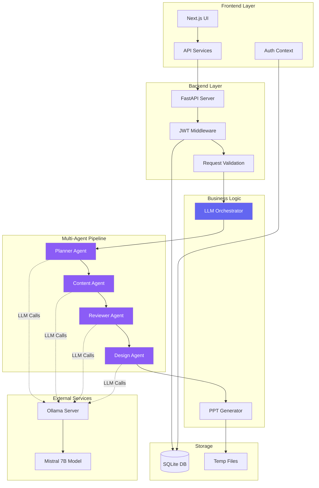
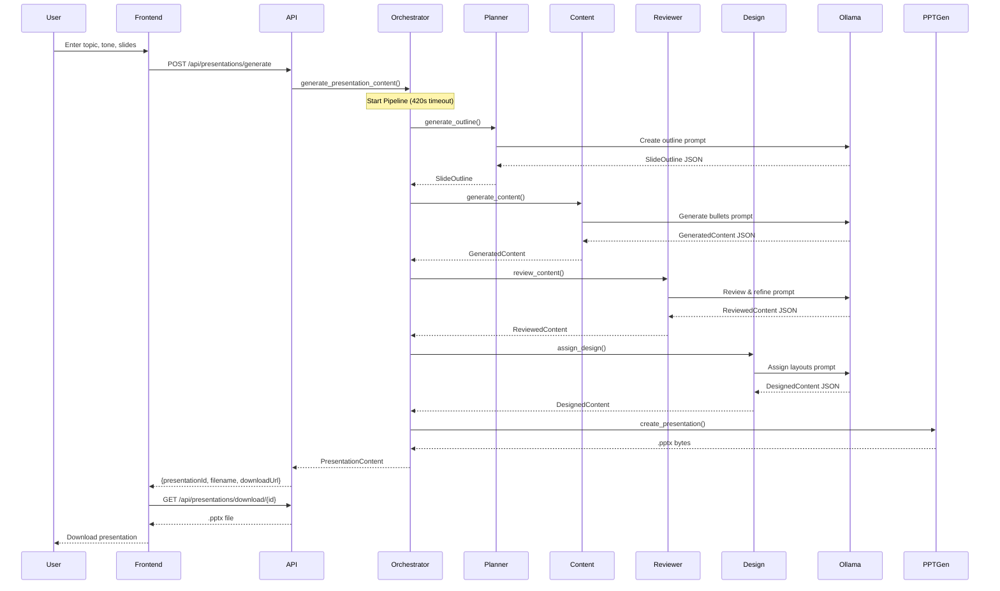
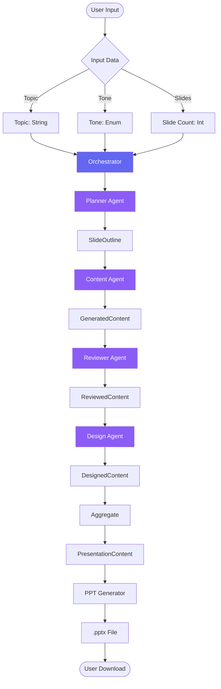
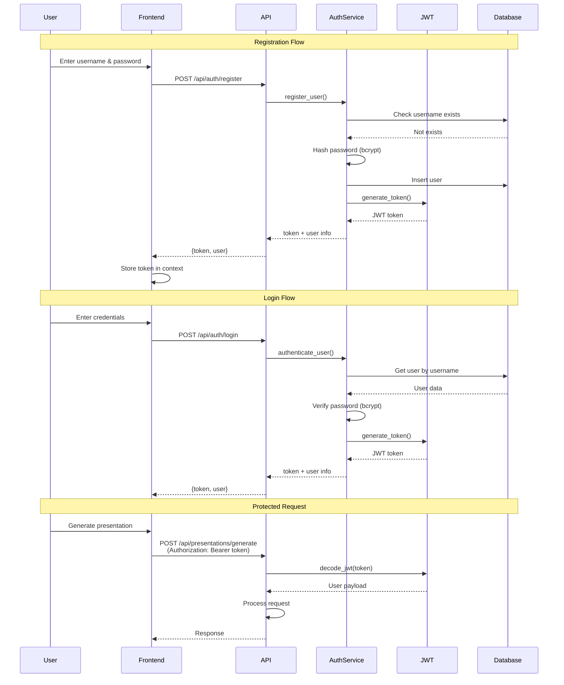
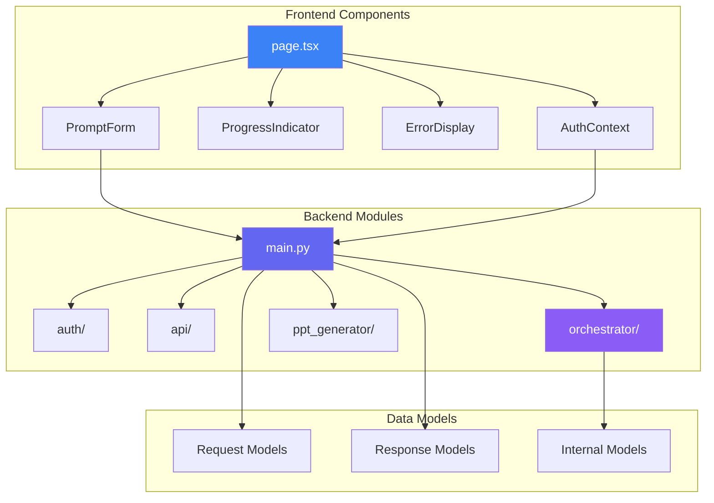
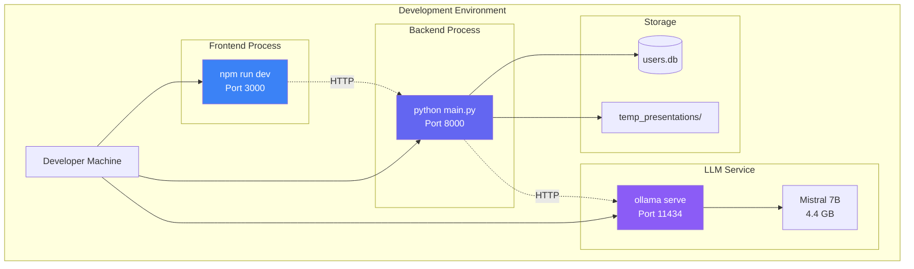
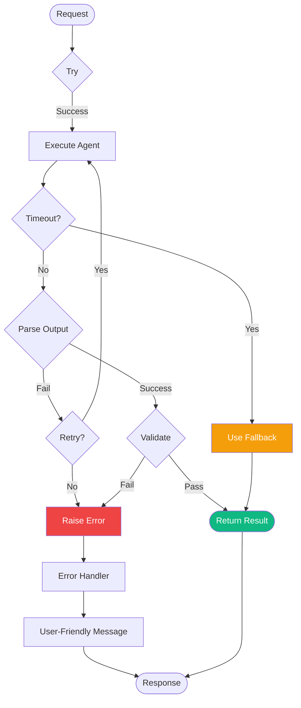
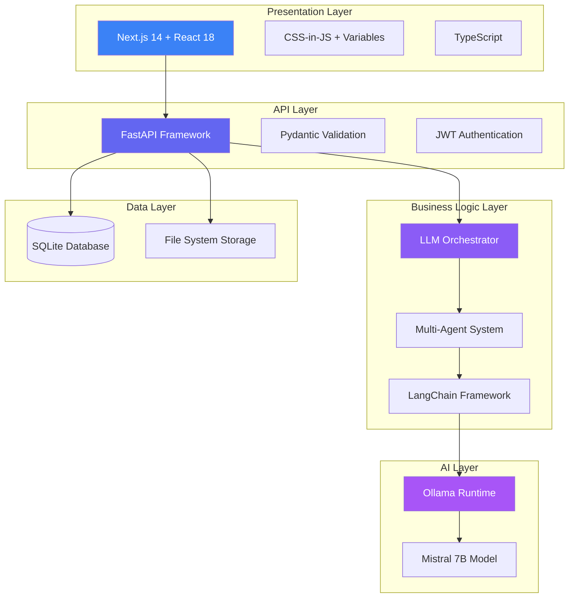

# Architecture Diagrams - AI PowerPoint Generator

## System Architecture Diagram

## Multi-Agent Pipeline Flow

## LangChain Agent Architecture

```mermaid
graph LR
    subgraph "Planner Agent"
        P1[Prompt Template]
        P2[LLM Chain]
        P3[Output Parser]
        P4[Retry Logic]
        
        P1 --> P2
        P2 --> P3
        P3 --> P4
    end
    
    subgraph "Content Agent"
        C1[Prompt Template]
        C2[LLM Chain]
        C3[Output Parser]
        C4[Validation]
        
        C1 --> C2
        C2 --> C3
        C3 --> C4
    end
    
    subgraph "Reviewer Agent"
        R1[Prompt Template]
        R2[LLM Chain]
        R3[Output Parser]
        R4[Quality Check]
        
        R1 --> R2
        R2 --> R3
        R3 --> R4
    end
    
    subgraph "Design Agent"
        D1[Prompt Template]
        D2[LLM Chain]
        D3[Output Parser]
        D4[Layout Assignment]
        
        D1 --> D2
        D2 --> D3
        D3 --> D4
    end
    
    P4 --> C1
    C4 --> R1
    R4 --> D1
    
    style P1 fill:#e0e7ff
    style C1 fill:#e0e7ff
    style R1 fill:#e0e7ff
    style D1 fill:#e0e7ff
```

## Data Flow Diagram

## Authentication Flow

## Component Interaction Diagram

## Deployment Architecture

## Error Handling Flow

## Technology Stack Layers

---

## Diagram Explanations

### 1. System Architecture
Shows the complete system with all layers and their interactions. Highlights the separation between frontend, backend, business logic, and external services.

### 2. Multi-Agent Pipeline Flow
Sequence diagram showing the exact order of operations from user input to file download, including all agent interactions with Ollama.

### 3. LangChain Agent Architecture
Details the internal structure of each agent, showing how LangChain components (prompts, chains, parsers) work together.

### 4. Data Flow
Illustrates how data transforms as it moves through the pipeline, from simple user input to complex presentation content.

### 5. Authentication Flow
Shows both registration and login flows, plus how JWT tokens are used to protect API endpoints.

### 6. Component Interaction
High-level view of how frontend components interact with backend modules.

### 7. Deployment Architecture
Shows how the application runs in development, with all processes and their ports.

### 8. Error Handling Flow
Demonstrates the robust error handling with retries, fallbacks, and user-friendly messages.

### 9. Technology Stack Layers
Visualizes the technology stack organized by architectural layers.

---

## How to Use These Diagrams in Your Demo

1. **Start with System Architecture** - Give the big picture
2. **Zoom into Multi-Agent Pipeline** - Show the sequential flow
3. **Explain LangChain Agents** - Detail the AI components
4. **Show Data Flow** - Demonstrate data transformation
5. **Highlight Error Handling** - Emphasize robustness

These diagrams are in Mermaid format and can be rendered in:
- GitHub/GitLab markdown
- VS Code with Mermaid extension
- Online tools like mermaid.live
- Presentation tools that support Mermaid
